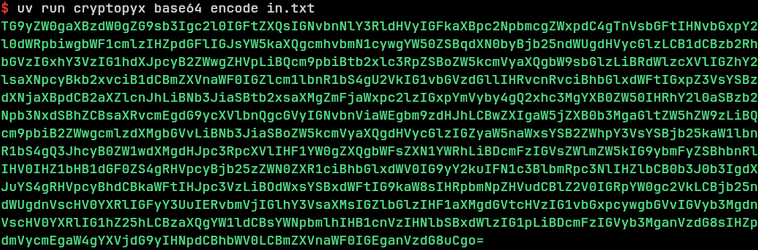

# CryptoPyX

[](https://github.com/astral-sh/ruff)
[](https://github.com/astral-sh/uv)
[](https://pypi.org/project/cryptopyx)
[](https://github.com/syan212/CryptoPyX/actions/workflows/CI.yml)
[](https://github.com/syan212/CryptoPyX/actions/workflows/dependabot/dependabot-updates)
[](https://github.com/syan212/CryptoPyX/actions/workflows/pypi.yml)

[](https://github.com/syan212/CryptoPyX/blob/main/LICENSE)

A python cryptography package written in Rust made for speed.

## Example Library Usage

``` python
from cryptopyx.encodings import base32
base32.encode_bytes(b'Hello World')  # b'JBSWY3DPEBLW64TMMQ======'
base32.decode_bytes(b'JBSWY3DPEBLW64TMMQ======')  # b'Hello World'
```

## Example CLI Usage



## Installation guide

### Install from PyPI

This package supports Python 3.10 and above

``` shell
pip install cryptopyx
```

See `Building From Source` below for more information.

## Documentation

The documentation is still work in progress, but you can see it here: [Documentation website](https://cryptopyx.readthedocs.io).

## Building From source

To build from source without Rust after cloning the repository, simply run

``` shell
pip install .
```

## Licence

This is licensed under MIT licence. See `LICENSE` for full information.
